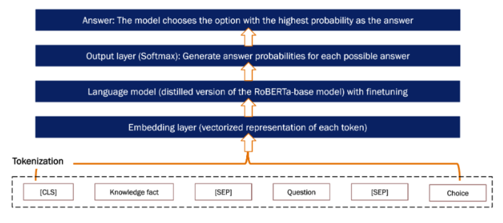
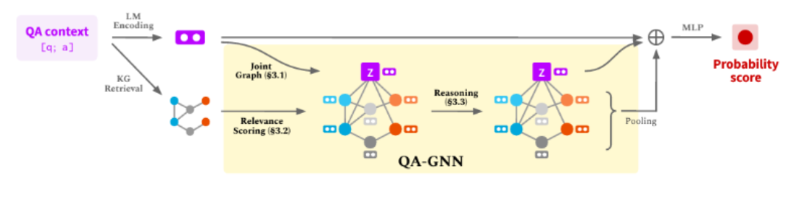
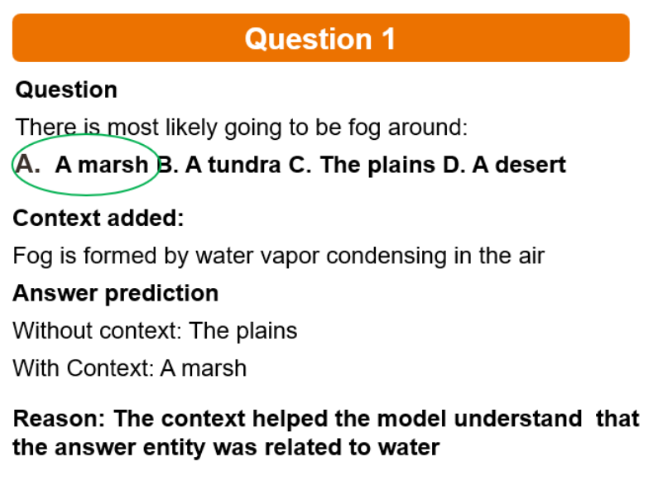
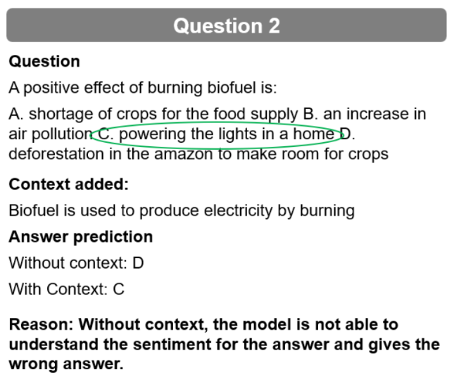

# Question-Answering-using-QA-GNN-with-external-context-fusion

The project was completed as part of the CSE6240 course at Georgia Tech. It was completed while working with Manoj Parmar, Sanchita Porwal, and Shreyas Verma.

The final project report can be found here: [Link](https://github.com/pchoudhary23/Question-Answering-using-QA-GNN-with-external-context-fusion/blob/main/Report.pdf)

The final project presentation can be found here: [Link](https://github.com/pchoudhary23/Question-Answering-using-QA-GNN-with-external-context-fusion/blob/main/Presentation.pdf)

The result of the project is a question-answering system based on a QA-GNN architecture with the utilization of external context. QA-GNN involves using language models (LMs) to encode QA context and retrieve a knowledge subgraph (KG) from the QA entities. The joint representation of the QA context and the KG subgraph is passed through the graph neural network (GNN) module for reasoning. The final model incorporates language understanding through LMs, structured reasoning through KGs, and external context on LM entities through knowledge facts.

## APPROACH 1 : LM-ONLY QA MODEL ##

Fig 1: LM Architecture

This approach only utilizes LM models for question-answering problems.
- Run LMQA_final.ipynb

## APPROACH 2 : QAGNN [LM+KG QA MODEL] ##

Fig 2: QA-GNN Architecture

This approach implements the QA-GNN model for question-answering problems.

****Step 1 : COMPUTE USED****

2 RTX-6000 GPUs [Cuda 11.7.0]

**Step 2 : CREATE ENVIRONMENT****

conda create -n qagnn python=3.7
source activate qagnn
pip install torch -f https://download.pytorch.org/whl/torch_stable.html
pip install transformers==3.4.0
pip install nltk spacy==2.1.6
python -m spacy download en
pip install torch-sparse torch-geometric torch-scatter -f https://pytorch-geometric.com/whl/torch-{torch.__version__}.html

**Step 4 : DOWNLOAD RAW DATA**

./ download_raw_data.sh

**Step 3 : CREATE PREPROCESSED DATA**

python preprocess.py

**Step 4 :  RUN BASH FILE**

./ run_qagnn__obqa.sh

- Check saved_model folder for epoch-wise predictions on test and metric csv
- Check logs/ for training status.

## Results ##

Below are few examples highlighting the impact of incorporating external context (knowledge facts) in question-answering task. The final model is a QA-GNN with additional external context.

Fig 3: Sample Question 1 deep-dive

Fig 4: Sample Question 2 deep-dive

